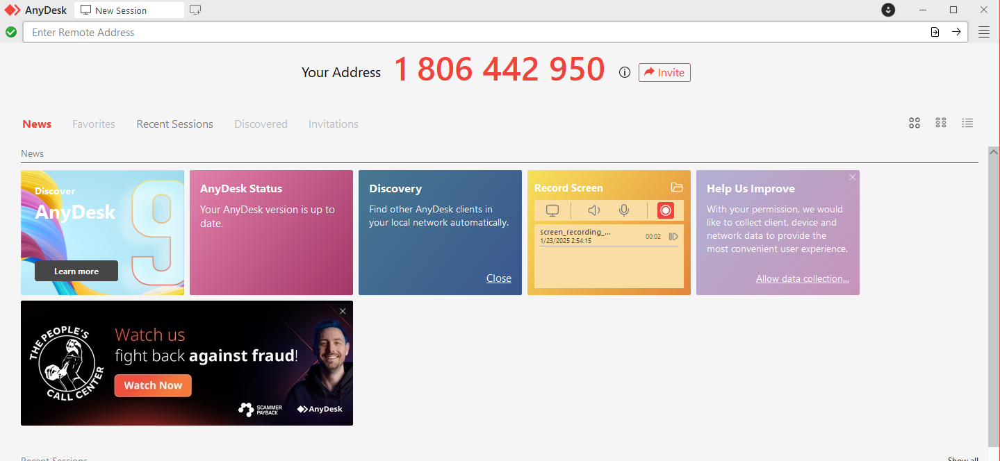
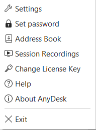
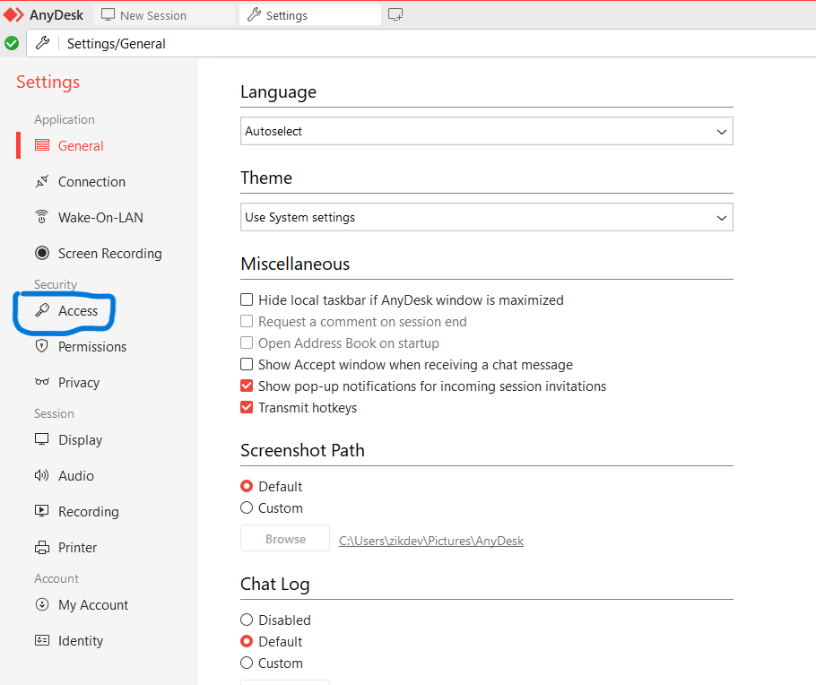
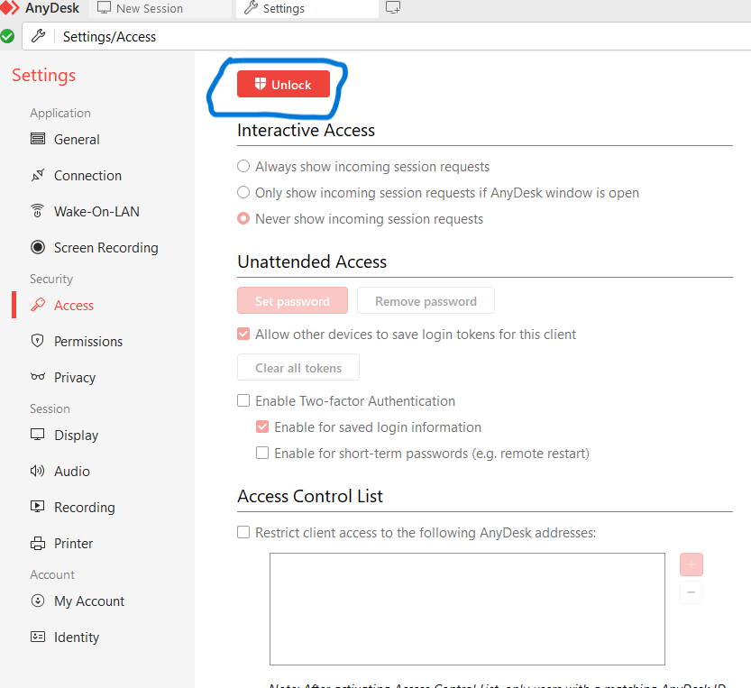
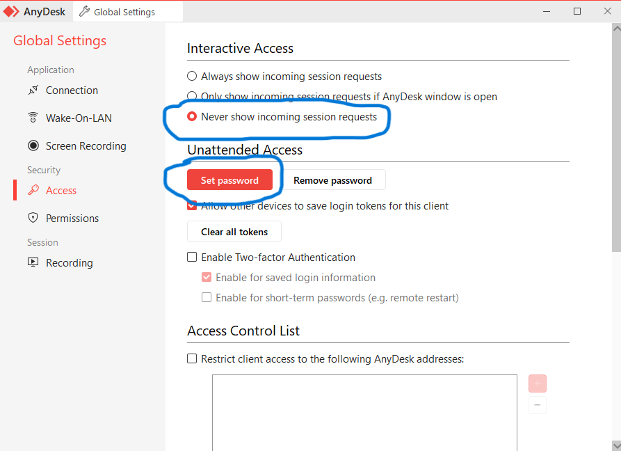

# remote

## use anydesk
-
-
-
<details>
  <summary>📌 Anydesk remote </summary>

  ## Cách sủ dụng anydesk auto ket noi voi thiet bi
  - Đầu tiên cài đặt anydesk tu trang chủ chính thức
  ---
  ---
  - Bước 1: trên màn hình chính chọn cài đặt
  - 
  - Bước 2: setting
  - 
  - Bước 3: chọn access
  - 
  - Bước 4: Unlook pypass
  - 
  - Bước 5: set passwd
  - 
  -Bước 6: set passwd allow full access
   - 
```sh
echo "Hello World!"
```

</details>


-
-
-
## Đối với server no port
-
-
-
<details>
  <summary>📌 Remote server linux no port </summary>
  
  
  ## Cách remote shell server no port
  ---
  ---
  B1 cần cài
</details>
-
-
-
